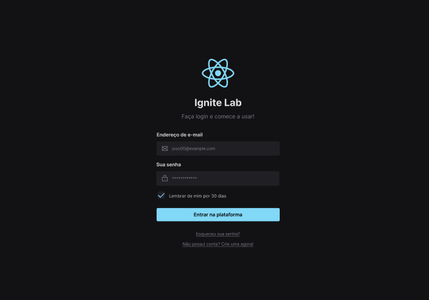

# Ignite Lab - Design System

Projeto desenvolvido durante o Ignite Lab - Rocketseat, nesse evento desenvolvemos um design system do Figma ao ReactJs, utilizando o Storybook para documentar.

## Tecnologias utilizadas:

- ReactJs
- Typescript
- Storybook
- Radix ui
- TailwindCSS
- Vite
- Phospor Icons

## 🌐 Link

Você pode acessar o site hospedado na internet através [desse link](https://lnkd.in/ddSFpY97).

## Storybook

Você pode acessar a documentação no storybook através [desse link](https://lnkd.in/dQckd25w).

## 🔖 Layout

Você pode visualizar o layout do projeto através [desse link](https://lnkd.in/dPm_Fwd7). É necessário ter conta no [Figma](https://figma.com) para acessá-lo.
